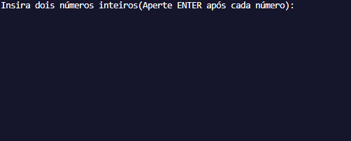

# ☕ Exercícios de Lógica em Java

Repositório dedicado à resolução de exercícios de estruturas de repetição e validação de dados.

---

## 🚀 Exercícios

<table width="100%">
  <tr>
    <td width="50%">
      <h3>01. Validação de Nota</h3>
      
Peça uma nota entre zero e dez. Mostre uma mensagem caso o valor seja inválido e continue pedindo até que o usuário informe um valor válido.

    </td>
    <td width="50%">
      
    </td>
  </tr>
</table>

<table width="100%">
  <tr>
    <td width="50%">
      <h3>02. Usuário e Senha</h3>
      
Lê um nome de usuário e a sua senha e não aceita a senha igual ao nome do usuário, exibindo erro e voltando a pedir as informações.

    </td>
    <td width="50%">
      
    </td>
  </tr>
</table>

<table width="100%">
  <tr>
    <td width="50%">
      <h3>03. Validação de Informações</h3>
      
Valida os campos: <b>Nome</b> (>3 caracteres), <b>Idade</b> (0-150), <b>Salário</b> (>0), <b>Sexo</b> (f/m) e <b>Estado Civil</b> (s, c, v, d).

    </td>
    <td width="50%">
      
    </td>
  </tr>
</table>

<table width="100%">
  <tr>
    <td width="50%">
      <h3>04. Crescimento Populacional</h3>
      
Calcula o tempo necessário para que a população do país A (80.000) ultrapasse a do país B (200.000) com base em suas taxas anuais de crescimento.

    </td>
    <td width="50%">
      
    </td>
  </tr>
</table>

<table width="100%">
  <tr>
    <td width="50%">
      <h3>05. Crescimento Customizado</h3>
      
Versão dinâmica do exercício anterior, permitindo que o usuário informe as populações e taxas iniciais com validação.

    </td>
    <td width="50%">
      
    </td>
  </tr>
</table>

<table width="100%">
  <tr>
    <td width="50%">
      <h3>06. Números de 1 a 20</h3>
      
Imprime os números de 1 a 20 de duas formas: verticalmente (um abaixo do outro) e horizontalmente (lado a lado).

    </td>
    <td width="50%">
      
    </td>
  </tr>
</table>

<table width="100%">
  <tr>
    <td width="50%">
      <h3>07. Identificador de Maior</h3>
      
Lê 5 números e informa ao usuário qual foi o maior valor digitado durante a execução do programa.

    </td>
    <td width="50%">
      
    </td>
  </tr>
</table>

<table width="100%">
  <tr>
    <td width="50%">
      <h3>08. Soma e Média</h3>
      
Lê 5 números e apresenta o resultado da soma total e o cálculo da média aritmética entre eles.

    </td>
    <td width="50%">
      
    </td>
  </tr>
</table>

<table width="100%">
  <tr>
    <td width="50%">
      <h3>09. Filtro de Ímpares</h3>
      
Algoritmo que percorre o intervalo de 1 a 50 e imprime na tela apenas os valores que são ímpares.

    </td>
    <td width="50%">
      
    </td>
  </tr>
</table>

<table width="100%">
  <tr>
    <td width="50%">
      <h3>10. Gerador de Intervalo</h3>
      
Recebe dois números inteiros e exibe todos os números que estão no intervalo compreendido por eles.

    </td>
    <td width="50%">
      
    </td>
  </tr>
</table>

---

## 🛠️ Tecnologias
* **Linguagem:** Java
* **JDK:** Versão 11 ou superior
* **IDE Sugerida:** IntelliJ IDEA / VS Code / Eclipse
